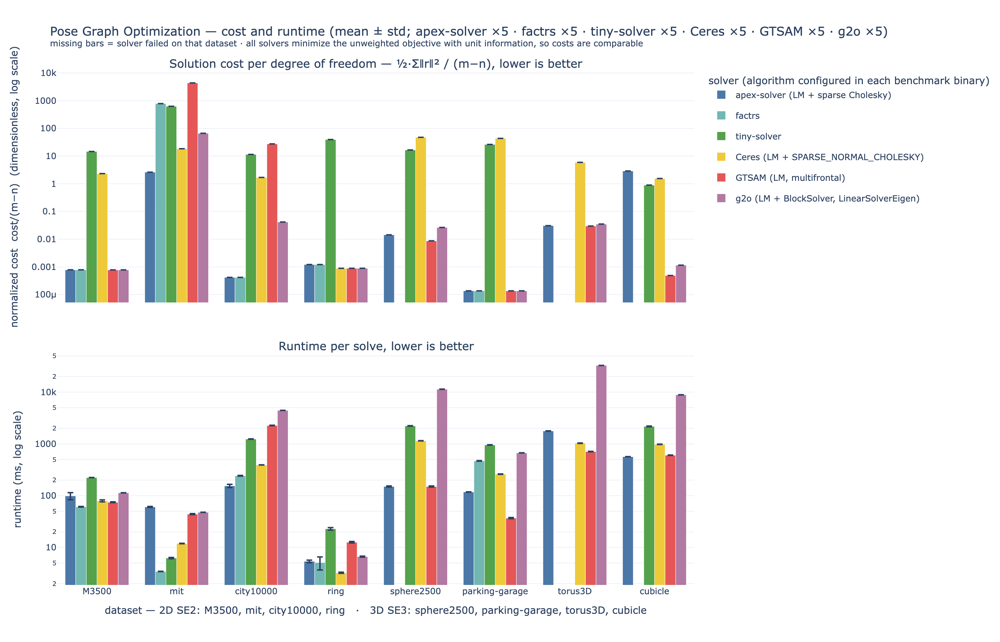
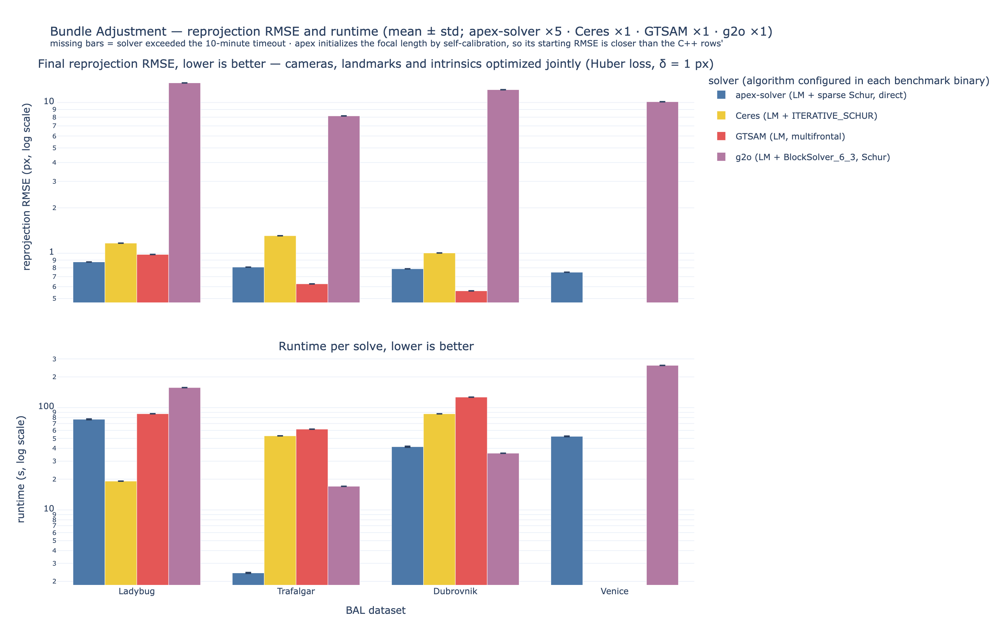

# Performance Benchmarks

**Hardware**: Apple Mac Mini M4, 64GB RAM
**Build**: Rust release (`opt-level=3`, LTO); C++ `-O3 -DNDEBUG -march=native`
**apex-solver state**: `fc2ced6` — direct sparse Schur complement for BA
(`SchurVariant::Sparse`), sparse Cholesky for pose graphs, all Schur fixes and
improvements of 2026-09-01 included.
**Methodology**: 5 independent runs per benchmark, reported as **mean ± std**.
Timing covers the `optimize()` call only — problem setup and metric computation
are excluded. Bundle adjustment uses a 10-minute timeout per solver.
**Metrics**: final objective value (cost) and runtime, following the pose graph
optimization literature ([SE-Sync, Rosen et al. IJRR 2019](https://david-m-rosen.github.io/publication/sesync-ijrr/SESync-IJRR.pdf); [Carlone et al. ICRA 2015](https://dellaert.github.io/files/Carlone15icra1.pdf)). Bundle adjustment uses reprojection RMSE and runtime ([arXiv:2409.12190](https://arxiv.org/abs/2409.12190)).

Solution cost is deterministic for a fixed input and algorithm, so its std is zero; the error bars reflect runtime variation.

## Pose Graph Optimization

Six solvers, Levenberg-Marquardt throughout. Cost is computed by the benchmark harness directly from the G2O file for every solver, so values are comparable across implementations. `cost/(m−n)` normalizes by degrees of freedom (m = edges, n = poses) so datasets of different size are comparable.



*[Interactive version](plots/odometry_benchmark.html)*

### 2D Datasets (SE2)

| Dataset | Solver | Final Cost | cost/(m−n) | Time (ms) | Iters |
|---------|--------|-----------|------------|-----------|-------|
| **M3500** (3500 poses, 5453 edges) |
| | apex-solver | 1.5238e+00 | 7.801e-04 | 98.9 ± 14.0 | 14 |
| | factrs | 1.5238e+00 | 7.802e-04 | **61.0 ± 0.7** | - |
| | tiny-solver | 2.8604e+04 | 1.465e+01 | 223.3 ± 0.7 | - |
| | Ceres | 4.5437e+03 | 2.326e+00 | 79.5 ± 3.0 | 18 |
| | GTSAM | 1.5111e+00 | **7.737e-04** | 74.7 ± 1.1 | 6 |
| | g2o | 1.5109e+00 | **7.737e-04** | 113.3 ± 0.4 | 33 |
| **mit** (808 poses, 827 edges) |
| | apex-solver | 4.9767e+01 | **2.619e+00** | 60.6 ± 1.1 | 93 |
| | factrs | 1.4831e+04 | 7.806e+02 | **3.4 ± 0.0** | - |
| | tiny-solver | 1.1933e+04 | 6.280e+02 | 6.2 ± 0.2 | - |
| | Ceres | 3.4865e+02 | 1.835e+01 | 11.9 ± 0.1 | 29 |
| | GTSAM | 8.3309e+04 | 4.385e+03 | 44.0 ± 0.9 | 4 |
| | g2o | 1.2571e+03 | 6.616e+01 | 47.8 ± 0.1 | 100 |
| **city10000** (10000 poses, 20687 edges) |
| | apex-solver | 4.4330e+00 | **4.148e-04** | **154.4 ± 9.9** | 6 |
| | factrs | 4.4330e+00 | **4.148e-04** | 242.4 ± 2.8 | - |
| | tiny-solver | 1.2237e+05 | 1.145e+01 | 1240.6 ± 9.7 | - |
| | Ceres | 1.8045e+04 | 1.689e+00 | 392.4 ± 1.4 | 27 |
| | GTSAM | 2.9292e+05 | 2.741e+01 | 2265.1 ± 20.1 | 22 |
| | g2o | 4.4232e+02 | 4.139e-02 | 4435.1 ± 9.0 | 100 |
| **ring** (434 poses, 459 edges) |
| | apex-solver | 3.0176e-02 | 1.207e-03 | 5.4 ± 0.3 | 12 |
| | factrs | 3.0176e-02 | 1.207e-03 | 5.1 ± 1.3 | - |
| | tiny-solver | 9.8712e+02 | 3.948e+01 | 22.9 ± 1.1 | - |
| | Ceres | 2.2188e-02 | 8.875e-04 | **3.2 ± 0.1** | 14 |
| | GTSAM | 2.2179e-02 | **8.872e-04** | 12.6 ± 0.4 | 6 |
| | g2o | 2.2179e-02 | **8.872e-04** | 6.7 ± 0.1 | 34 |

### 3D Datasets (SE3)

| Dataset | Solver | Final Cost | cost/(m−n) | Time (ms) | Iters |
|---------|--------|-----------|------------|-----------|-------|
| **sphere2500** (2500 poses, 4949 edges) |
| | apex-solver | 3.4929e+01 | 1.426e-02 | **150.3 ± 3.2** | 5 |
| | factrs | - | - | - | ✗ |
| | tiny-solver | 4.0584e+04 | 1.657e+01 | 2224.6 ± 21.4 | - |
| | Ceres | 1.1654e+05 | 4.759e+01 | 1146.6 ± 5.1 | 90 |
| | GTSAM | 2.1298e+01 | **8.697e-03** | **150.2 ± 3.5** | 7 |
| | g2o | 6.4554e+01 | 2.636e-02 | 11371.8 ± 34.3 | 84 |
| **parking-garage** (1661 poses, 6275 edges) |
| | apex-solver | 6.2779e-01 | 1.361e-04 | 117.8 ± 0.7 | 8 |
| | factrs | 6.2778e-01 | 1.361e-04 | 469.0 ± 5.1 | - |
| | tiny-solver | 1.2116e+05 | 2.626e+01 | 952.8 ± 6.5 | - |
| | Ceres | 2.0103e+05 | 4.357e+01 | 260.5 ± 1.9 | 34 |
| | GTSAM | 6.2471e-01 | **1.354e-04** | **36.9 ± 0.9** | 3 |
| | g2o | 6.2869e-01 | 1.363e-04 | 670.6 ± 1.4 | 56 |
| **torus3D** (5000 poses, 9048 edges) |
| | apex-solver | 1.2413e+02 | 3.067e-02 | 1773.4 ± 8.2 | 32 |
| | factrs | - | - | - | ✗ |
| | tiny-solver | - | - | - | ✗ |
| | Ceres | 2.3940e+04 | 5.914e+00 | 1032.1 ± 9.6 | 38 |
| | GTSAM | 1.2032e+02 | **2.972e-02** | **709.5 ± 6.4** | 12 |
| | g2o | 1.4131e+02 | 3.491e-02 | 32745.5 ± 79.3 | 96 |
| **cubicle** (5750 poses, 16869 edges) |
| | apex-solver | 3.2029e+04 | 2.880e+00 | **565.5 ± 1.9** | 8 |
| | factrs | - | - | - | ✗ |
| | tiny-solver | 9.9185e+03 | 8.920e-01 | 2174.1 ± 31.9 | - |
| | Ceres | 1.7144e+04 | 1.542e+00 | 980.9 ± 6.7 | 29 |
| | GTSAM | 5.3897e+00 | **4.847e-04** | 604.2 ± 5.0 | 5 |
| | g2o | 1.2771e+01 | 1.148e-03 | 8865.7 ± 37.5 | 47 |

**Observations**:
- **apex-solver** reaches the lowest cost on mit and city10000 (tied with factrs
  on city10000 — both minimize the same Ω-weighted objective), and is the
  **fastest 3D solver on cubicle** (565 ms, 1.7× ahead of GTSAM) and
  sphere2500 (tied with GTSAM).
- **GTSAM** remains the accuracy leader on M3500, ring, parking-garage, torus3D
  and cubicle, and the fastest on parking-garage.
- **g2o** is consistently the slowest (32.7 s on torus3D, 11.4 s on sphere2500);
  **factrs** fails on three of four 3D datasets; **tiny-solver** rarely reaches a
  good solution; **Ceres** trails on cost (its odometry configuration uses
  `function_tolerance = 1e-3`, looser than the others — configuration, not a
  Ceres limitation).
- apex uses the same linear solver (sparse Cholesky) for every odometry dataset;
  GN and Dog-Leg variants exist (`pose_graph_g2o` binary) but LM is what this
  table compares.

## Bundle Adjustment (Self-Calibration)

Large-scale BAL datasets, optimizing **camera poses, 3D landmarks, and camera
intrinsics simultaneously**. apex-solver uses the **direct sparse Schur
complement** (`SchurVariant::Sparse`: form `JᵀJ`, eliminate the landmarks,
sparse-Cholesky on the reduced camera system) with a Huber loss (δ = 1 px).
The chunked, matrix-free and explicit-iterative variants produce identical
results at different memory/speed trade-offs — see
`doc/schur-complement-approaches.md`.



*[Interactive version](plots/ba_benchmark.html)*

| Dataset | Solver | Cameras | Landmarks | Observations | Final RMSE (px) | Time (s) | Iters |
|---------|--------|---------|-----------|--------------|-----------------|----------|-------|
| **Ladybug** |
| | apex-solver | 1,723 | 156,502 | 678,718 | **0.8753 ± 0.0000** | 76.9 ± 0.6 | 21 |
| | Ceres * | 1,723 | 156,502 | 678,718 | 1.1657 | 19.1 | 101 |
| | GTSAM * | 1,723 | 156,502 | 678,718 | 0.9812 | 87.2 | 2 |
| | g2o * | 1,723 | 156,502 | 678,718 | 13.5074 | 157.2 | 20 |
| **Trafalgar** |
| | apex-solver | 257 | 65,132 | 225,911 | 0.8085 ± 0.0000 | **2.4 ± 0.0** | 7 |
| | Ceres * | 257 | 65,132 | 225,911 | 1.3061 | 53.0 | 101 |
| | GTSAM * | 257 | 65,132 | 225,911 | **0.6259** | 61.7 | 100 |
| | g2o * | 257 | 65,132 | 225,911 | 8.1506 | 17.0 | 20 |
| **Dubrovnik** |
| | apex-solver | 356 | 226,730 | 1,255,268 | 0.7875 ± 0.0000 | **41.5 ± 0.5** | 17 |
| | Ceres * | 356 | 226,730 | 1,255,268 | 1.0035 | 87.2 | 101 |
| | GTSAM * | 356 | 226,730 | 1,255,268 | **0.5622** | 126.8 | 31 |
| | g2o * | 356 | 226,730 | 1,255,268 | 12.1678 | 35.8 | 20 |
| **Venice** (largest) |
| | apex-solver | 1,778 | 993,923 | 5,001,946 | **0.7476 ± 0.0000** | **52.4 ± 0.4** | 2 |
| | Ceres * | 1,778 | 993,923 | 5,001,946 | TIMEOUT | TIMEOUT | - |
| | GTSAM * | 1,778 | 993,923 | 5,001,946 | TIMEOUT | TIMEOUT | - |
| | g2o * | 1,778 | 993,923 | 5,001,946 | 10.1261 | 259.4 | 20 |

\* C++ rows are a **single context run** (2026-09-01); apex rows are mean ± std
of 5 runs. apex also initializes the focal length by self-calibration, so its
starting RMSE is closer than the C++ rows'.

**Observations**:
- **Scalability**: apex-solver remains the only solver to finish Venice within
  the timeout (5M observations, 0.748 px in 52.4 s). Ceres and GTSAM still
  exceed the 10-minute timeout; g2o finishes but barely moves (10.128 → 10.126 px).
- **Accuracy vs the previous table**: apex's RMSE is *higher* than the 15 Aug
  numbers (e.g. Ladybug 0.7700 → 0.8753) — this is **not** a solver regression.
  The Aug 6 robust-cost fix changed the objective apex minimizes to the true
  `½·Σρ(s)` (Ceres convention, with the same Huber loss as the C++ rows);
  `doc/rmse-regression-investigation.md` proves the plain least-squares path is
  bit-identical before/after and identifies the objective change as the cause.
- **Speed**: apex is fastest on Trafalgar (2.4 s, 22× vs Ceres), Dubrovnik and
  Venice; Ceres is faster on Ladybug (19 s vs 77 s — its `ITERATIVE_SCHUR`
  converges the first iterations cheaply there).
- **g2o** never meaningfully reduces reprojection error within its 20-iteration cap.

---

## Change history

- **2026-09-01** — Schur complement rework round: direct sparse Schur default
  for BA (`24e8482`), four silent-wrong-step guards fixed, chunked path
  allocation/parallel-`Jᵀr` improvements (`361cb93`), fresh 5-run measurements
  (hybrid protocol). Delta report: `doc/benchmark-update-2026-09-01.md`.
  Related analyses: `doc/rmse-regression-investigation.md` (why BA RMSE moved),
  `doc/schur-rework-review.md`, `doc/schur-fixround-results.md`,
  `doc/schur-complement-approaches.md`.

## Reproducing

```bash
# 5 runs each, raw per-run CSVs archived to output/runs/
bash benches/tools/run_repeated.sh odometry_pose_benchmark 5

# BA, apex-only 5 runs (C++ rows below were produced by one context run of the
# same command WITHOUT the env var — Venice Ceres/GTSAM consume the timeout):
APEX_BENCH_RUST_ONLY=1 bash benches/tools/run_repeated.sh bundle_adjustment_benchmark 5

# aggregate to output/*_aggregated.csv and render doc/plots/*.{html,png}
uv run --with plotly --with kaleido --with pandas benches/tools/plot_benchmarks.py
```

---

*Back to [README](../README.md)*
