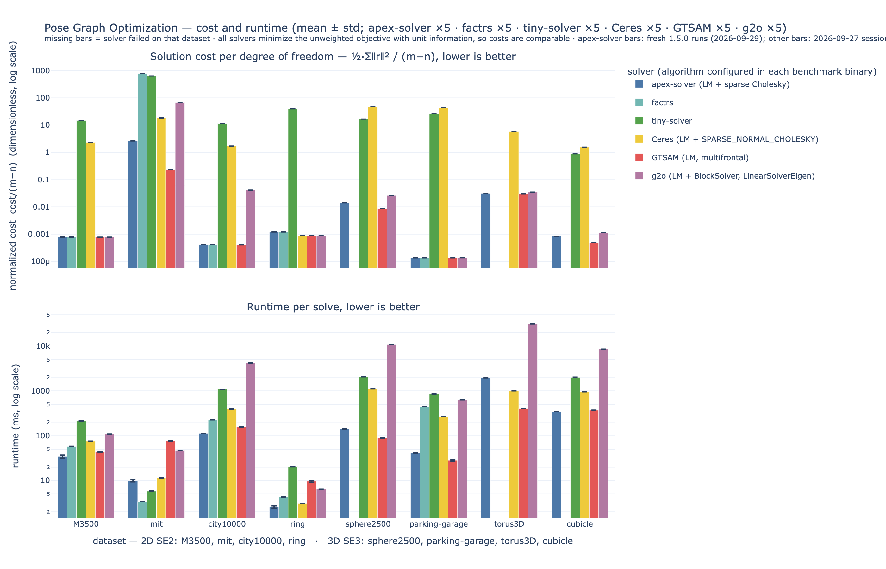
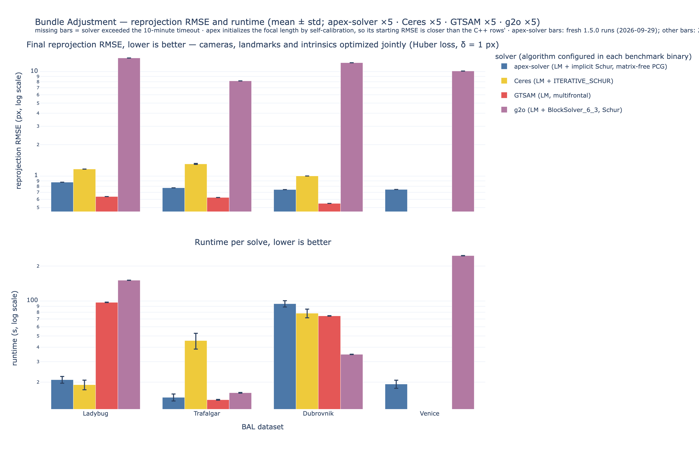

# Performance Benchmarks

**Hardware**: Apple Mac mini M4 (10 cores), 32 GB RAM, macOS
**Build**: Rust 1.98 release (`opt-level=3`, LTO); C++ `-O3 -DNDEBUG -march=native`
**Solvers**: apex-solver on `feature/criterion` — pose-graph rows measured at
`a3ef66d`, bundle-adjustment rows at `69f717e` (row-parallel implicit Schur
operator, Exp 008). Solver numerics are identical across that range on every
dataset (see `benchmarking_results/verification_post_a3ef66d.md` and
`baseline_vs_current_m4.md`), so only BA timing moved; Ceres 2.2.0; **GTSAM 4.3.0**;
g2o 20241228; factrs and tiny-solver from `Cargo.lock`. Eigen 5.0.1 for all C++ solvers.
apex uses the matrix-free Schur complement for BA (`ImplicitSparseSchur`,
Schur-Jacobi preconditioner, PCG forcing sequence η = 1e-2) and sparse Cholesky
for pose graphs.
**Measured**: 2026-09-27.
**Methodology**: 5 independent runs per benchmark **for every solver, C++ included**
(apex BA rows: 3 runs of `69f717e`), reported as **mean ± std**. Timing covers the `optimize()` call only — problem setup
and metric computation are excluded. Bundle adjustment uses a 10-minute timeout per solver.
**Metrics**: final objective value (cost) and runtime, following the pose graph
optimization literature ([SE-Sync, Rosen et al. IJRR 2019](https://david-m-rosen.github.io/publication/sesync-ijrr/SESync-IJRR.pdf); [Carlone et al. ICRA 2015](https://dellaert.github.io/files/Carlone15icra1.pdf)). Bundle adjustment uses reprojection RMSE and runtime ([arXiv:2409.12190](https://arxiv.org/abs/2409.12190)).

Solution cost is deterministic for a fixed input and algorithm, so its std is zero; the error bars reflect runtime variation.

> **GTSAM rows before 2026-09-27 were wrong.** The C++ harness compiled GTSAM
> against eigen@3 while a system-Eigen GTSAM is built on Eigen 5; the ABI mismatch
> built cleanly but broke linearization (with 4.3.0: LM rejected every step, 0
> iterations, cost rising). Fixed in `14d3c82`; every GTSAM number below is from
> the fixed harness. Earlier GTSAM rows (e.g. mit 8.3e4, BA RMSE on Ladybug 0.98)
> should not be compared against.

## Pose Graph Optimization

Six solvers, Levenberg-Marquardt throughout. Cost is computed by the benchmark harness directly from the G2O file for every solver, so values are comparable across implementations. `cost/(m−n)` normalizes by degrees of freedom (m = edges, n = poses) so datasets of different size are comparable. **Bold** = best cost / fastest time per dataset.



*[Interactive version](plots/odometry_benchmark.html)*

### 2D Datasets (SE2)


| Dataset | Solver | Final Cost | cost/(m−n) | Time (ms) | Iters |
|---------|--------|-----------|------------|-----------|-------|
| **M3500** (3500 poses, 5453 edges) |
| | apex-solver | 1.5238e+00 | 7.802e-04 | **39.2 ± 3.3** | 6 |
| | factrs | 1.5238e+00 | 7.802e-04 | 57.5 ± 0.6 | - |
| | tiny-solver | 2.8604e+04 | 1.465e+01 | 210.6 ± 3.2 | - |
| | Ceres | 4.5437e+03 | 2.327e+00 | 75.3 ± 0.3 | 18 |
| | GTSAM | 1.5109e+00 | **7.737e-04** | 43.5 ± 0.4 | 6 |
| | g2o | 1.5109e+00 | **7.737e-04** | 107.9 ± 0.5 | 33 |
| **mit** (808 poses, 827 edges) |
| | apex-solver | 4.9970e+01 | 2.630e+00 | 9.6 ± 0.1 | 15 |
| | factrs | 1.4831e+04 | 7.806e+02 | **3.4 ± 0.0** | - |
| | tiny-solver | 1.1933e+04 | 6.280e+02 | 5.8 ± 0.1 | - |
| | Ceres | 3.4865e+02 | 1.835e+01 | 11.5 ± 0.1 | 29 |
| | GTSAM | 4.4154e+00 | **2.324e-01** | 77.2 ± 1.3 | 25 |
| | g2o | 1.2571e+03 | 6.616e+01 | 46.6 ± 0.3 | 100 |
| **city10000** (10000 poses, 20687 edges) |
| | apex-solver | 4.4330e+00 | 4.148e-04 | **115.8 ± 1.0** | 5 |
| | factrs | 4.4330e+00 | 4.148e-04 | 225.8 ± 2.0 | - |
| | tiny-solver | 1.2237e+05 | 1.145e+01 | 1081.7 ± 5.0 | - |
| | Ceres | 1.8045e+04 | 1.689e+00 | 392.2 ± 2.2 | 27 |
| | GTSAM | 4.3620e+00 | **4.082e-04** | 156.6 ± 1.3 | 6 |
| | g2o | 4.4232e+02 | 4.139e-02 | 4192.6 ± 12.8 | 100 |
| **ring** (434 poses, 459 edges) |
| | apex-solver | 3.0176e-02 | 1.207e-03 | **2.5 ± 0.1** | 5 |
| | factrs | 3.0176e-02 | 1.207e-03 | 4.3 ± 0.0 | - |
| | tiny-solver | 9.8712e+02 | 3.948e+01 | 20.6 ± 0.2 | - |
| | Ceres | 2.2188e-02 | 8.875e-04 | 3.1 ± 0.0 | 14 |
| | GTSAM | 2.2179e-02 | **8.872e-04** | 9.6 ± 0.4 | 6 |
| | g2o | 2.2179e-02 | **8.872e-04** | 6.4 ± 0.0 | 34 |

### 3D Datasets (SE3)


| Dataset | Solver | Final Cost | cost/(m−n) | Time (ms) | Iters |
|---------|--------|-----------|------------|-----------|-------|
| **sphere2500** (2500 poses, 4949 edges) |
| | apex-solver | 3.4912e+01 | 1.426e-02 | 143.9 ± 0.3 | 5 |
| | factrs | - | - | - | ✗ |
| | tiny-solver | 4.0584e+04 | 1.657e+01 | 2048.9 ± 7.0 | - |
| | Ceres | 1.1654e+05 | 4.759e+01 | 1112.2 ± 6.9 | 90 |
| | GTSAM | 2.1291e+01 | **8.694e-03** | **88.8 ± 1.8** | 6 |
| | g2o | 6.4554e+01 | 2.636e-02 | 10893.4 ± 52.9 | 84 |
| **parking-garage** (1661 poses, 6275 edges) |
| | apex-solver | 6.2809e-01 | 1.361e-04 | 47.8 ± 0.2 | 2 |
| | factrs | 6.2777e-01 | 1.361e-04 | 440.9 ± 1.4 | - |
| | tiny-solver | 1.2116e+05 | 2.626e+01 | 852.6 ± 7.9 | - |
| | Ceres | 2.0103e+05 | 4.357e+01 | 267.8 ± 1.1 | 34 |
| | GTSAM | 6.2456e-01 | **1.354e-04** | **28.3 ± 0.9** | 4 |
| | g2o | 6.2869e-01 | 1.363e-04 | 634.5 ± 2.3 | 56 |
| **torus3D** (5000 poses, 9048 edges) |
| | apex-solver | 1.2488e+02 | 3.085e-02 | 1907.8 ± 3.6 | 38 |
| | factrs | - | - | - | ✗ |
| | tiny-solver | - | - | - | ✗ |
| | Ceres | 2.3940e+04 | 5.914e+00 | 1006.1 ± 6.3 | 38 |
| | GTSAM | 1.2035e+02 | **2.973e-02** | **402.9 ± 2.0** | 10 |
| | g2o | 1.4131e+02 | 3.491e-02 | 31136.3 ± 67.6 | 96 |
| **cubicle** (5750 poses, 16869 edges) |
| | apex-solver | 9.3491e+00 | 8.408e-04 | **361.8 ± 2.0** | 5 |
| | factrs | - | - | - | ✗ |
| | tiny-solver | 9.9185e+03 | 8.920e-01 | 1982.1 ± 23.9 | - |
| | Ceres | 1.7144e+04 | 1.542e+00 | 955.3 ± 3.3 | 29 |
| | GTSAM | 5.3761e+00 | **4.835e-04** | 369.8 ± 2.9 | 5 |
| | g2o | 1.2771e+01 | 1.149e-03 | 8497.3 ± 5.7 | 47 |

**Observations**:
- **Speed**: apex-solver is the fastest solver on 5 of 8 datasets — M3500 (39 ms),
  city10000 (116 ms, 1.35× GTSAM, 3.4× Ceres), ring (2.5 ms), cubicle (362 ms, level
  with GTSAM's 370 ms) and, among solvers that reach a good solution, mit (9.6 ms;
  factrs and tiny-solver are faster there but end at 300× apex's cost). **GTSAM 4.3 is
  fastest on the three remaining 3D sets**: sphere2500 (89 vs 144 ms), parking-garage
  (28 vs 48 ms) and torus3D (403 ms vs 1.91 s — apex needs 38 iterations to GTSAM's 10).
- **Cost**: GTSAM 4.3 reaches the lowest `cost/(m−n)` on **all 8** datasets (tied with
  g2o on M3500 and ring). apex's final cost is within 1 % of it on M3500 (1.5238 vs
  1.5109) and parking-garage (0.6281 vs 0.6246), within 4 % on city10000 (+1.6 %) and
  torus3D (+3.8 %), and materially higher on ring (0.0302 vs 0.0222, +36 %), sphere2500
  (34.91 vs 21.29), cubicle (9.35 vs 5.38) and mit (49.97 vs 4.42). mit is the one where apex was previously reported as
  best by a wide margin — that comparison was against the broken GTSAM build.
- apex's cubicle cost is 9.35 (was 4.6e3 in the previous edition of this page — the
  indefinite-Ω repair and the estimation-correctness fixes since then).
- **g2o** is consistently the slowest (31.1 s on torus3D, 10.9 s on sphere2500);
  **factrs** fails to load three of four 3D datasets; **tiny-solver** rarely reaches a
  good solution; **Ceres** trails on cost (its odometry configuration uses
  `function_tolerance = 1e-3` — configuration, not a Ceres limitation).
- apex uses sparse Cholesky for every odometry dataset; GN and Dog-Leg variants exist
  (`pose_graph_g2o` binary) but LM is what this table compares.

## Bundle Adjustment (Self-Calibration)

Large-scale BAL datasets, optimizing **camera poses, 3D landmarks, and camera
intrinsics simultaneously**, Huber loss (δ = 1 px) for every solver. apex-solver
runs its library default, the **matrix-free Schur complement** (`ImplicitSparseSchur`:
neither `JᵀJ` nor `S` is formed; the reduced operator is applied straight from `J`
inside PCG, Schur-Jacobi preconditioner, forcing sequence η = 1e-2), capped at 20
LM iterations (21 evaluations). **Bold** = best RMSE / fastest time per dataset.



*[Interactive version](plots/ba_benchmark.html)*


| Dataset | Solver | Cameras | Landmarks | Observations | Final RMSE (px) | Time (s) | Iters |
|---|---|---|---|---|---|---|---|
| **Ladybug** |
| | apex-solver | 1,723 | 156,502 | 678,718 | 0.8747 ± 0.0000 | 20.0 ± 0.2 | 21 |
| | Ceres (iterative_schur) | 1,723 | 156,502 | 678,718 | 1.1676 ± 0.0012 | **19.0 ± 1.8** | 101 |
| | GTSAM | 1,723 | 156,502 | 678,718 | **0.6372 ± 0.0000** | 97.3 ± 0.4 | 16 |
| | g2o | 1,723 | 156,502 | 678,718 | 13.5074 ± 0.0000 | 150.8 ± 0.2 | 20 |
| **Trafalgar** |
| | apex-solver | 257 | 65,132 | 225,911 | 0.7728 ± 0.0000 | 14.2 ± 0.4 | 21 |
| | Ceres (iterative_schur) | 257 | 65,132 | 225,911 | 1.3082 ± 0.0135 | 45.6 ± 7.1 | 101 |
| | GTSAM | 257 | 65,132 | 225,911 | **0.6242 ± 0.0000** | **14.1 ± 0.1** | 26 |
| | g2o | 257 | 65,132 | 225,911 | 8.1506 ± 0.0000 | 16.2 ± 0.1 | 20 |
| **Dubrovnik** |
| | apex-solver | 356 | 226,730 | 1,255,268 | 0.7432 ± 0.0000 | 88.3 ± 0.0 | 21 |
| | Ceres (iterative_schur) | 356 | 226,730 | 1,255,268 | 1.0036 ± 0.0000 | 78.4 ± 6.7 | 101 |
| | GTSAM | 356 | 226,730 | 1,255,268 | **0.5476 ± 0.0000** | 74.4 ± 0.3 | 29 |
| | g2o | 356 | 226,730 | 1,255,268 | 12.1678 ± 0.0000 | **34.7 ± 0.1** | 20 |
| **Venice** |
| | apex-solver | 1,778 | 993,923 | 5,001,946 | **0.7451 ± 0.0000** | **19.9 ± 0.4** | 2 |
| | Ceres | 1,778 | 993,923 | 5,001,946 | TIMEOUT | TIMEOUT | - |
| | GTSAM | 1,778 | 993,923 | 5,001,946 | TIMEOUT | TIMEOUT | - |
| | g2o | 1,778 | 993,923 | 5,001,946 | 10.1261 ± 0.0000 | 245.7 ± 0.6 | 20 |

apex also initializes the focal length by self-calibration, so its starting RMSE is
lower than the Ceres / g2o rows' (e.g. Dubrovnik 3.98 px vs 12.98 px); GTSAM's harness
starts lower still (2.81 px).

**Observations**:
- **Iteration counts are shaped by the parameter-tolerance test, not only by
  convergence.** apex (like Ceres) stops when `‖Δx‖ ≤ 1e-8·(‖x‖ + 1e-8)` over the whole
  parameter vector, and three of these BAL files contain a few degenerate cameras
  (focal length 1.1e10 on Trafalgar, 2.9e9 on Dubrovnik, 3.7e11 on Venice, against
  ~1e3 elsewhere). They set `‖x‖` alone, turning the test into an *absolute* step
  threshold of ≈ 110 / 40 / 5 900. Venice therefore stops after **2** iterations for every
  apex solver, and the explicit solver's 10–11 iterations on Trafalgar / Dubrovnik are the
  first step shorter than that threshold — not convergence (implicit keeps going and ends
  at a *lower* cost there, e.g. Trafalgar 6.746e4 vs 6.863e4). Ladybug (‖x‖ = 3.1e5) is
  unaffected: every solver runs to the cap.
- **Scalability**: apex-solver is the only solver besides g2o to finish **Venice**
  (5 M observations) inside the 10-minute timeout — 0.745 px in 20 s, i.e. 2 LM
  iterations ended by the test above; Ceres and GTSAM both time out, and g2o barely
  moves (10.128 → 10.126 px in 246 s over 20 iterations).
- **Accuracy — GTSAM 4.3 leads on the three datasets it finishes**: Ladybug 0.637 vs
  apex 0.875 px, Trafalgar 0.624 vs 0.773, Dubrovnik 0.548 vs 0.743. This is the open
  item on this benchmark; the forcing-sequence inexactness accounts for ~1 % of it (the
  exact `ExplicitSparseSchur` lands within 1.2 % of the implicit RMSE, table below),
  so it is a genuine difference in the optimum reached, not a tolerance artefact.
- **Speed**: apex is fastest on Venice (19.9 s), within 1.05× of the fastest on Ladybug
  (20.0 s vs Ceres 19.0 s, whose RMSE is 1.17 px) and level with GTSAM on Trafalgar
  (14.2 vs 14.1 s); GTSAM is faster on Dubrovnik (74 vs 88 s). The row-parallel implicit
  operator (`69f717e`, Exp 008) took 16–31 % off apex's Ladybug / Trafalgar / Dubrovnik
  times at identical RMSE and iteration counts (`benchmarking_results/baseline_vs_current_m4.md`).
- **Why apex's BA times are higher than in the previous edition** (Trafalgar 6.3 s →
  14.2 s, Dubrovnik 31.5 s → 88 s): commit `f078711` fixed the gauge-fixed camera
  being solved as a free variable and zeroed afterwards. Before it, LM's step-quality
  check compared the model decrease of one step with the cost change of another and
  stopped early (9 / 17 iterations) at a worse optimum; with the fix every dataset
  reaches a **lower** RMSE (Trafalgar 0.798 → 0.773, Dubrovnik 0.769 → 0.743), but the
  implicit solver now runs to the iteration cap. See
  `benchmarking_results/verification_post_a3ef66d.md` §6.
- **g2o** never meaningfully reduces reprojection error within its 20-iteration cap.

### Schur solver comparison

All four sparse Schur configurations on the same four datasets, 3 runs each,
`APEX_BENCH_RUST_ONLY=1`, same machine and revision as above.
`ExplicitSparseSchur / Sparse` solves the reduced system exactly and is the RMSE
reference; the two PCG paths stop on the forcing sequence, so their steps are
deliberately inexact.

| Dataset | Solver | Final RMSE | Time (s) | Iters | × Sparse |
|---|---|---|---|---|---|
| **Ladybug** | ExplicitSparseSchur / Sparse | 0.874205 | 61.75 ± 0.29 | 21 | 1.00× |
| | ExplicitSparseSchur / Chunked | 0.874205 | 88.51 ± 0.26 | 21 | 1.43× |
| | ExplicitSparseSchur / Iterative | 0.874795 | 31.12 ± 0.05 | 21 | 0.50× |
| | **ImplicitSparseSchur** | 0.874681 | **20.01 ± 0.22** | 21 | **0.32×** |
| **Trafalgar** | **ExplicitSparseSchur / Sparse** | 0.779496 | **3.36 ± 0.02** | 11 | **1.00×** |
| | ExplicitSparseSchur / Chunked | 0.779496 | 6.10 ± 0.04 | 11 | 1.82× |
| | ExplicitSparseSchur / Iterative | 0.770103 | 6.83 ± 0.00 | 21 | 2.03× |
| | ImplicitSparseSchur | 0.772831 | 14.23 ± 0.44 | 21 | 4.23× |
| **Dubrovnik** | **ExplicitSparseSchur / Sparse** | 0.743998 | **24.65 ± 0.12** | 10 | **1.00×** |
| | ExplicitSparseSchur / Chunked | 0.743998 | 51.36 ± 0.07 | 10 | 2.08× |
| | ExplicitSparseSchur / Iterative | 0.743206 | 51.40 ± 0.04 | 21 | 2.09× |
| | ImplicitSparseSchur | 0.743193 | 88.27 ± 0.04 | 21 | 3.58× |
| **Venice** | ExplicitSparseSchur / Sparse | 0.736946 | 53.58 ± 0.57 | 2 | 1.00× |
| | ExplicitSparseSchur / Chunked | 0.736946 | 64.24 ± 0.36 | 2 | 1.20× |
| | ExplicitSparseSchur / Iterative | 0.745048 | 45.32 ± 0.58 | 2 | 0.85× |
| | **ImplicitSparseSchur** | 0.745052 | **19.90 ± 0.41** | 2 | **0.37×** |

- The explicit-sparse path is 1.22× faster than in the previous edition on Ladybug at
  the same 21 iterations (75.2 → 61.8 s: the optimization program's pattern-cached
  extraction, bitmap Schur output, CSC gather assembly and symbolic-Cholesky cache).
  Dubrovnik (41.9 → 24.7 s) also needs fewer iterations now (17 → 10, after `f078711`),
  so its gain is not purely per-iteration.
- **Read the Trafalgar / Dubrovnik rows with the parameter-tolerance caveat above.**
  `ExplicitSparseSchur / Sparse` is 3.6–4.2× faster there because its 10th–11th step happens to
  fall under the ≈ 110 / 40 absolute threshold the degenerate cameras create, while the
  PCG paths' steps stay longer and run to the cap — reaching a lower cost (Trafalgar
  RMSE 0.7728 vs 0.7795). Per iteration, explicit / Sparse is 0.31 s vs implicit 0.68 s on
  Trafalgar and 2.5 s vs 4.2 s on Dubrovnik; implicit is 2.7–3.1× faster in total on
  Ladybug and Venice, where the iteration counts match. (Explicit rows measured at
  `a3ef66d`; Exp 008 does not touch the explicit path. Implicit rows at `69f717e`.)
- These numbers supersede the previous table, which was recorded while
  `APEX_BENCH_SCHUR=sparse|chunked|explicit-iterative` silently ran the implicit
  solver (fixed in `5a912b8`).

`ExplicitDenseSchur` cannot run these datasets — a dense `JᵀJ` for the smallest
of them would be ~485k × 485k; it is for problems of a few thousand DOF
(`APEX_BENCH_SCHUR=explicit-dense` runs a truncated Ladybug instead).

---

## Reproducing

```bash
# 5 runs each (Rust and C++ solvers), raw per-run CSVs archived to output/runs/
bash benches/tools/run_repeated.sh odometry_pose_benchmark 5
bash benches/tools/run_repeated.sh bundle_adjustment_benchmark 5   # ~3 h: Venice times out Ceres and GTSAM

# Schur solver comparison (apex only)
for v in sparse chunked explicit-iterative iterative; do
  APEX_BENCH_RUST_ONLY=1 APEX_BENCH_SCHUR=$v cargo bench --bench bundle_adjustment_benchmark
done

# aggregate to output/*_aggregated.csv and render doc/plots/*.{html,png}
uv run --with plotly --with kaleido --with pandas benches/tools/plot_benchmarks.py
```

If the C++ solvers were upgraded, delete `benches/cpp_comparison/build/` first: the
benchmarks skip the CMake step whenever the executables already exist.

### Selecting a Schur solver

`APEX_BENCH_SCHUR` selects which of apex-solver's Schur complement
solvers `bundle_adjustment_benchmark` runs, and — when the C++ comparison
binaries are also built — forwards the matching `CERES_LINEAR_SOLVER` value
to `ceres_ba_benchmark` so the two sides compare the same conceptual solver:

| `APEX_BENCH_SCHUR` | apex-solver | Ceres (`CERES_LINEAR_SOLVER`) |
|---|---|---|
| unset (default) | library default: `ImplicitSparseSchur` | Ceres default (`iterative_schur` in the harness) |
| `sparse` | `ExplicitSparseSchur` / `Sparse` | `sparse_schur` (`SPARSE_SCHUR`) |
| `chunked` | `ExplicitSparseSchur` / `Chunked` | `sparse_schur` (algebraically identical `S`) |
| `iterative` | `ImplicitSparseSchur` | `iterative_schur` (`ITERATIVE_SCHUR` + `SCHUR_JACOBI`) |
| `explicit-iterative` | `ExplicitSparseSchur` / `Iterative` | `iterative_schur` (closest Ceres equivalent) |
| `explicit-dense` | `ExplicitDenseSchur` | `dense_schur` (`DENSE_SCHUR`) |

`explicit-dense` does **not** run the four BAL datasets. It runs `Ladybug-mini-<N>cam`
instead: Ladybug truncated to its first `N` cameras (`APEX_BENCH_DENSE_CAMERAS`,
default 4) and the landmarks they observe, solved twice — once with
`ExplicitDenseSchur` and once with `ExplicitSparseSchur` on the identical subset, so
the row carries its own accuracy reference.

`ceres_ba_benchmark` can also be pointed at a specific solver directly:
`CERES_LINEAR_SOLVER=dense_schur ./ceres_ba_benchmark path/to/problem.txt`.

---

*Back to [README](../README.md)*
